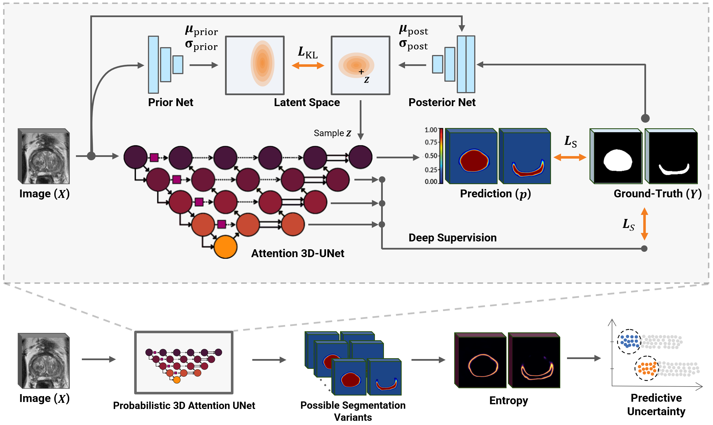

# Uncertainty-Aware Semi-Supervised Learning for Prostate MRI Zonal Segmentation

This repository contains the source code for our semi-supervised learning approach as explained in our [paper](https://arxiv.org/abs/2305.05984). We leverage pseudo-labeling techniques, deep learning uncertainty estimation models, and a Probabilistic Attention U-Net (PA-UNet) model for enhanced performance.

<kbd></kbd>
Schematic illustration of our probabilistic attention UNet (PA-UNet) model for segmentation. 


**Sample Usage**
1. To train the model, run the following command:
```
python train.py --TRAIN_OBJ zonal --NAME EXP_NAME --TRAIN_XLSX_PREFIX PATH_TO_TRAINING_LISTS --VALID_XLSX_PREFIX PATH_TO_VALIDATION_LISTS
```

In `train.py`, there are several command-line arguments that you can modify to adjust the model's hyperparameters. Some of these include:

- `--NUM_EPOCHS`: This parameter determines the number of training epochs. Default is set to 150.
- `--BATCH_SIZE`: This parameter sets the size of the batches that the model is trained on. Default is set to 1.
- `--RESUME_TRAIN`: Set this to 1 to enable resuming training from a previously saved state. Default is 1 (Enabled).
- `--UNET_DEEP_SUPERVISION`: Enable deep supervision in U-Net by setting this parameter to 1. Default is 0 (Disabled).
- `--UNET_PROBABILISTIC`: Enable Probabilistic/Bayesian output computation by setting this parameter to 1. Default is 0 (Disabled).
- `--UNET_PROBA_ITER`: This parameter determines the iterations of probabilistic inference during validation. Default is set to 1.


You can adjust these parameters according to your experiments and computational resources.

2. To validate the model, run the following command:
```
python validate.py --FOLDS 0,1,2,3,4 --NAME EXP_NAME
```

**Copyright and license**

Copyright 2023 Diagnostic Image Analysis Group (DIAG), Radboudumc, Nijmegen, The Netherlands

Licensed under the Apache License, Version 2.0 (the "License");
you may not use this file except in compliance with the License.
You may obtain a copy of the License at

    http://www.apache.org/licenses/LICENSE-2.0

Unless required by applicable law or agreed to in writing, software
distributed under the License is distributed on an "AS IS" BASIS,
WITHOUT WARRANTIES OR CONDITIONS OF ANY KIND, either express or implied.
See the License for the specific language governing permissions and
limitations under the License.

**Note**
Source code for Probabilistic Attention U-Net and preprocessings are adopted from this repository: [DIAGNijmegen/prostateMR_3D-CAD-csPCa](https://github.com/DIAGNijmegen/prostateMR_3D-CAD-csPCa).

**If you use this repository or parts of its codebase, please cite our paper:**  
[Hosseinzadeh, M., Saha, A., Bosma, J., Huisman, H. (2023). Uncertainty-Aware Semi-Supervised Learning for Prostate MRI Zonal Segmentation](https://arxiv.org/abs/2305.05984)

